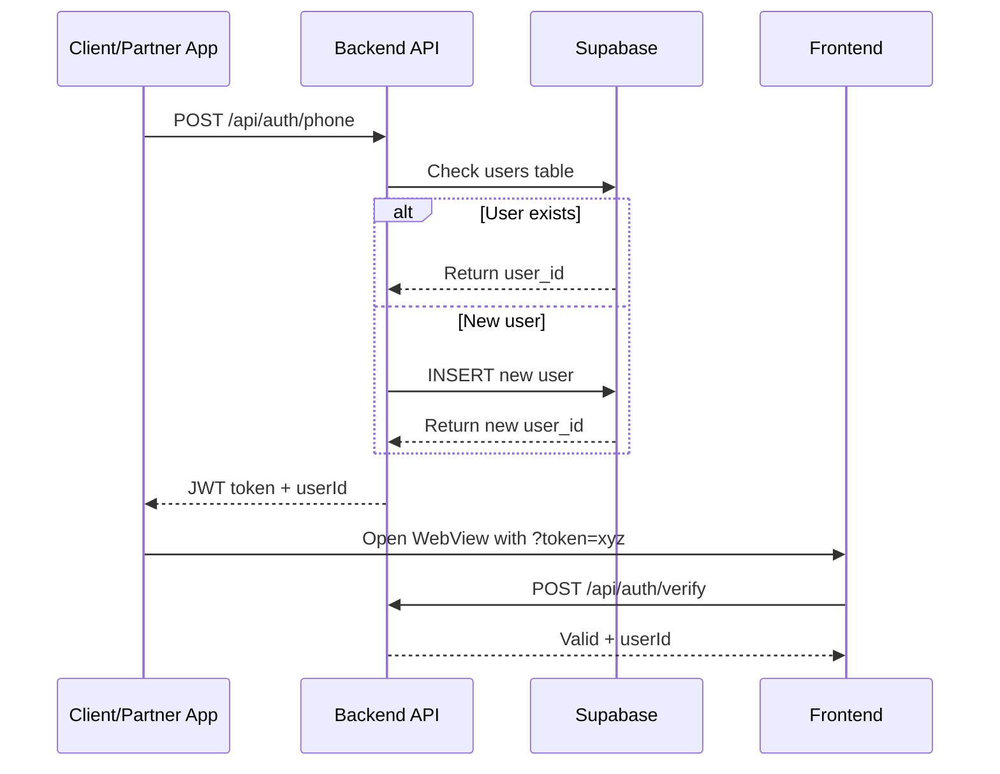

# Ovqat AI Backend API

Backend сервер для JWT-based аутентификации и управления пользователями.

## 🎯 Назначение

Backend API обеспечивает:
- ✅ JWT-based аутентификация по номеру телефона
- ✅ Создание и управление пользователями в Supabase
- ✅ Верификация токенов
- ✅ Health check для мониторинга

## 📦 Установка

```bash
cd server
npm install
```

### Зависимости

- `express` ^4.18.2 - Web framework
- `cors` ^2.8.5 - CORS middleware
- `dotenv` ^16.3.1 - Environment variables
- `jsonwebtoken` ^9.0.2 - JWT tokens
- `@supabase/supabase-js` ^2.38.4 - Supabase client
- `nodemon` ^3.0.1 (dev) - Auto-restart

## ⚙️ Конфигурация

### 1. Создайте .env файл

```bash
cp .env.example .env
```

### 2. Заполните переменные окружения

```bash
# Supabase Configuration
SUPABASE_URL=https://your-project.supabase.co
SUPABASE_SERVICE_ROLE_KEY=your_service_role_key_here

# JWT Configuration
JWT_SECRET=your_strong_jwt_secret_here

# Server Configuration
PORT=3001
```

**⚠️ Важно:**
- `SUPABASE_SERVICE_ROLE_KEY` - используйте Service Role Key (не Anon Key!)
- `JWT_SECRET` - используйте сложный секретный ключ (минимум 32 символа)
- Никогда не коммитьте `.env` в git!

## Запуск

### Development
```bash
npm run dev
```

### Production
```bash
npm start
```

Сервер запустится на `http://localhost:3001`

## API Endpoints

### POST /api/auth/phone
Аутентификация по номеру телефона

**Request:**
```json
{
  "phoneNumber": "998997961877"
}
```

**Response:**
```json
{
  "token": "eyJhbGciOiJIUzI1NiIs...",
  "userId": "27a2b872-93b4-44ba-8835-75163463e903"
}
```

### POST /api/auth/verify
Верификация JWT токена

**Request:**
```json
{
  "token": "eyJhbGciOiJIUzI1NiIs..."
}
```

**Response:**
```json
{
  "valid": true,
  "userId": "27a2b872-93b4-44ba-8835-75163463e903"
}
```

### GET /api/health
Health check

**Response:**
```json
{
  "status": "ok"
}
```

## 🔄 Workflow

### Аутентификация пользователя



## 🧪 Тестирование

### 1. Проверка работоспособности

```bash
curl http://localhost:3001/api/health
```

**Ожидаемый ответ:**
```json
{"status":"ok"}
```

### 2. Создание пользователя

```bash
curl -X POST http://localhost:3001/api/auth/phone \
  -H "Content-Type: application/json" \
  -d '{"phoneNumber": "998997961877"}'
```

**Ожидаемый ответ:**
```json
{
  "token": "eyJhbGciOiJIUzI1NiIsInR5cCI6IkpXVCJ9...",
  "userId": "27a2b872-93b4-44ba-8835-75163463e903"
}
```

### 3. Верификация токена

```bash
curl -X POST http://localhost:3001/api/auth/verify \
  -H "Content-Type: application/json" \
  -d '{"token": "YOUR_TOKEN_HERE"}'
```

**Ожидаемый ответ:**
```json
{
  "valid": true,
  "userId": "27a2b872-93b4-44ba-8835-75163463e903"
}
```

## 🚀 Использование с фронтенд приложением

### Локальная разработка

1. **Запустите backend:**
   ```bash
   cd server
   npm run dev
   ```
   Сервер запустится на `http://localhost:3001`

2. **Запустите frontend:**
   ```bash
   cd ..
   npm run dev
   ```
   Frontend запустится на `http://localhost:3000`

3. **Получите токен:**
   ```bash
   curl -X POST http://localhost:3001/api/auth/phone \
     -H "Content-Type: application/json" \
     -d '{"phoneNumber": "998997961877"}'
   ```

4. **Откройте приложение:**
   ```
   http://localhost:3000/?token=YOUR_TOKEN_HERE
   ```

Frontend автоматически:
- Прочитает токен из URL параметра
- Верифицирует его через `/api/auth/verify`
- Загрузит данные пользователя из Supabase
- Перенаправит на Home или Questionnaire

## 🔒 Безопасность

### JWT Token

- **Алгоритм:** HS256
- **Срок действия:** 7 дней
- **Payload:**
  ```json
  {
    "userId": "uuid",
    "phoneNumber": "998997961877",
    "iat": 1729872000,
    "exp": 1730476800
  }
  ```

### Best Practices

✅ **DO:**
- Используйте HTTPS в production
- Храните JWT_SECRET в безопасном месте
- Используйте Service Role Key для backend
- Валидируйте номера телефонов
- Логируйте все аутентификации

❌ **DON'T:**
- Не коммитьте .env файлы
- Не используйте Anon Key для backend
- Не храните токены в localStorage (используйте URL параметры)
- Не используйте слабые JWT_SECRET

## 📊 Логирование

Backend логирует все важные события:

```
🔍 Authenticating phone: 998997961877
✅ Existing user found: 27a2b872-93b4-44ba-8835-75163463e903
✅ Token generated
✅ Token verified: 27a2b872-93b4-44ba-8835-75163463e903
```

## 🐛 Troubleshooting

### Ошибка: "Database error"

**Причина:** Неправильный SUPABASE_URL или SUPABASE_SERVICE_ROLE_KEY

**Решение:**
1. Проверьте `.env` файл
2. Убедитесь что используете Service Role Key
3. Проверьте что таблица `users` существует в Supabase

### Ошибка: "Invalid token"

**Причина:** Токен истёк или неправильный JWT_SECRET

**Решение:**
1. Получите новый токен через `/api/auth/phone`
2. Убедитесь что JWT_SECRET одинаковый при создании и верификации

### Ошибка: "Failed to create user"

**Причина:** RLS политики блокируют INSERT

**Решение:**
1. Проверьте RLS политики в Supabase
2. Убедитесь что используете Service Role Key (он обходит RLS)
3. Примените миграцию из `../supabase/migrations/001_initial_schema.sql`

## 📚 Связанная документация

- [Supabase Migration Guide](../supabase/MIGRATION_GUIDE.md)
- [Database Schema](../supabase/SCHEMA_DIAGRAM.md)
- [Frontend README](../README.md)

## 🔗 Полезные ссылки

- [Express.js Documentation](https://expressjs.com/)
- [JWT.io](https://jwt.io/)
- [Supabase Documentation](https://supabase.com/docs)

---

**Версия:** 1.0.0  
**Порт:** 3001  
**Последнее обновление:** October 25, 2025
