# Ovqat AI Database Schema Diagram

## Entity Relationship Diagram

## Data Flow Diagram

## Authentication Flow

## Meal Tracking Flow

```mermaid
flowchart LR
    A[📸 Take Photo] --> B[🤖 AI Analysis]
    B --> C{Is Food?}
    C -->|Yes| D[Show Nutrition]
    C -->|No| E[Show Retake]
    D --> F[User Confirms]
    F --> G[Save to DB]
    G --> H[Update Cache]
    H --> I[Show in History]
    
    style A fill:#e1f5ff
    style B fill:#ffe1f5
    style D fill:#e1ffe1
    style E fill:#ffe1e1
    style G fill:#fff4e1
```

## Data Retention

## Table Relationships

### One-to-One Relationships
- `users` → `user_profiles` (1:1)
- `users` → `user_goals` (1:1)

### One-to-Many Relationships
- `users` → `user_meals` (1:N)

### Cascade Behavior
- Delete user → Deletes profile, goals, and all meals
- Delete meal → No cascade (isolated delete)

## Indexes Overview

## RLS Policy Structure

## Query Performance

### Fast Queries ✅
- Get user by phone: `idx_users_phone`
- Get meals by date: `idx_user_meals_user_id_date`
- Get recent meals: `idx_user_meals_created_at`
- Get profile: `idx_user_profiles_user_id`
- Get goals: `idx_user_goals_user_id`

### Slow Queries ⚠️
- Full table scans without WHERE
- Queries without indexed columns
- Complex JOINs across all tables

## Storage Estimates

### Per User (Average)

| Data Type | Size | Count | Total |
|-----------|------|-------|-------|
| User record | ~200 bytes | 1 | 200 B |
| Profile | ~500 bytes | 1 | 500 B |
| Goals | ~200 bytes | 1 | 200 B |
| Meal (no image) | ~500 bytes | 80 | 40 KB |
| Meal images | ~100 KB | 80 | 8 MB |
| **Total per user** | | | **~8 MB** |

### 10,000 Users
- Database: ~410 MB
- Images: ~80 GB
- **Total: ~80 GB**

## Backup Strategy

---

## Legend

| Symbol | Meaning |
|--------|---------|
| PK | Primary Key |
| FK | Foreign Key |
| UK | Unique Key |
| 📸 | User Action |
| 🤖 | AI Processing |
| ✅ | Optimized |
| ⚠️ | Needs Attention |

---

**Generated:** October 25, 2025  
**Schema Version:** 001  
**Tool:** Mermaid.js
